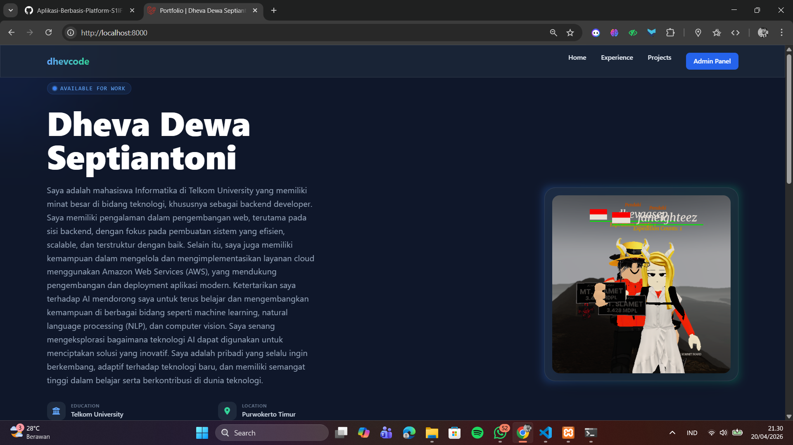
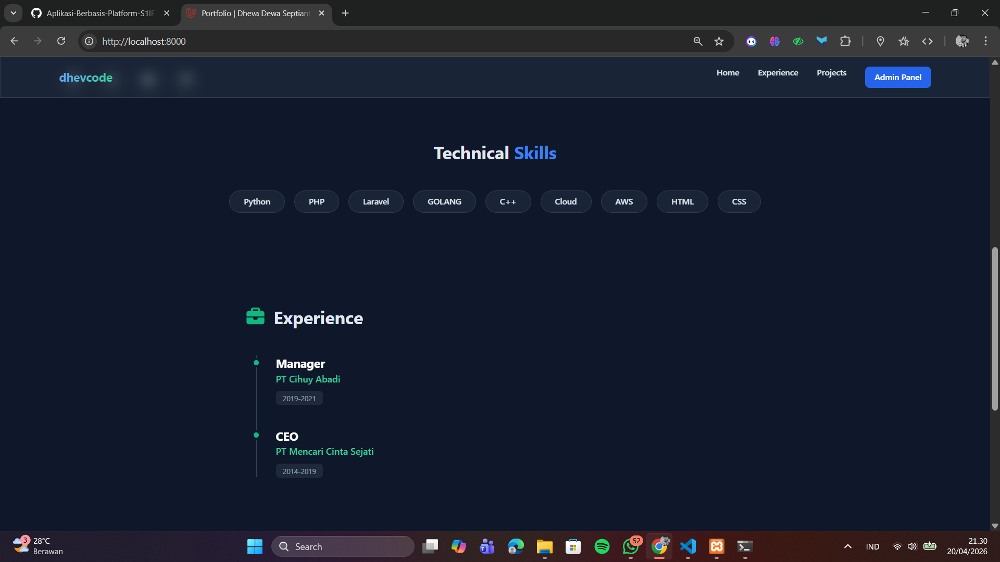
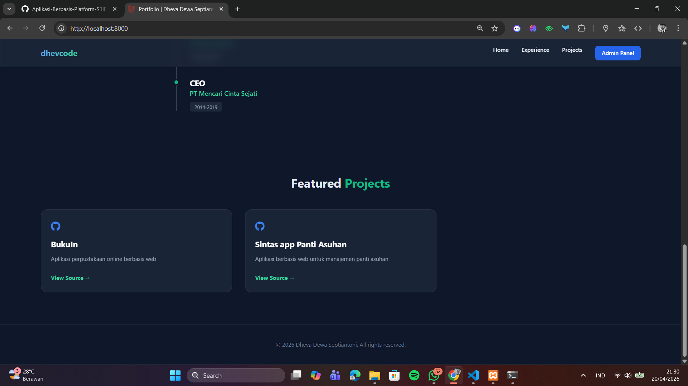
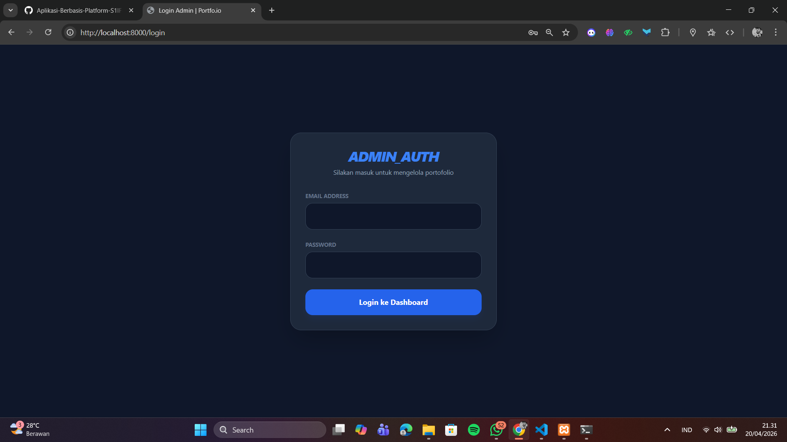
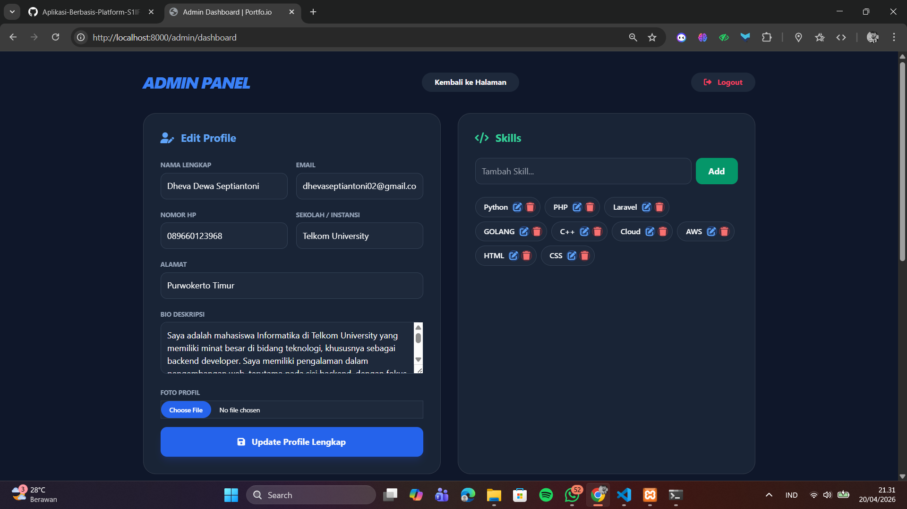
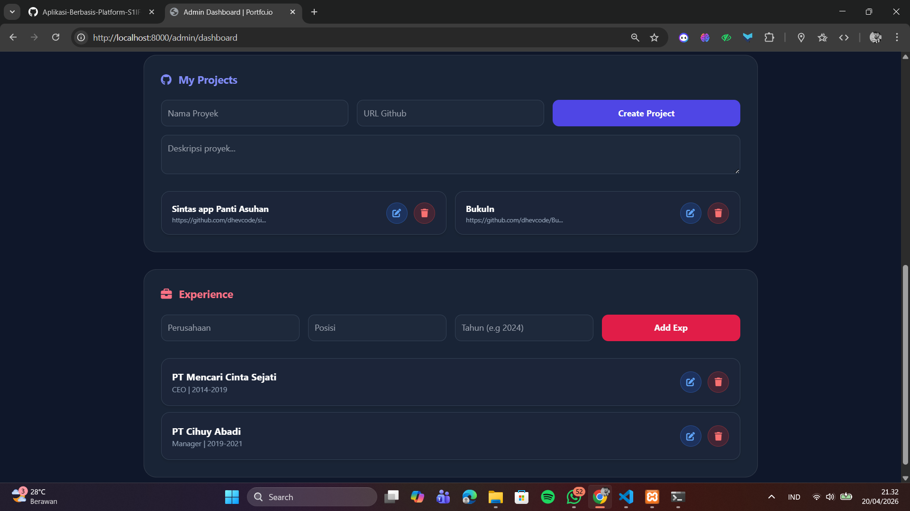
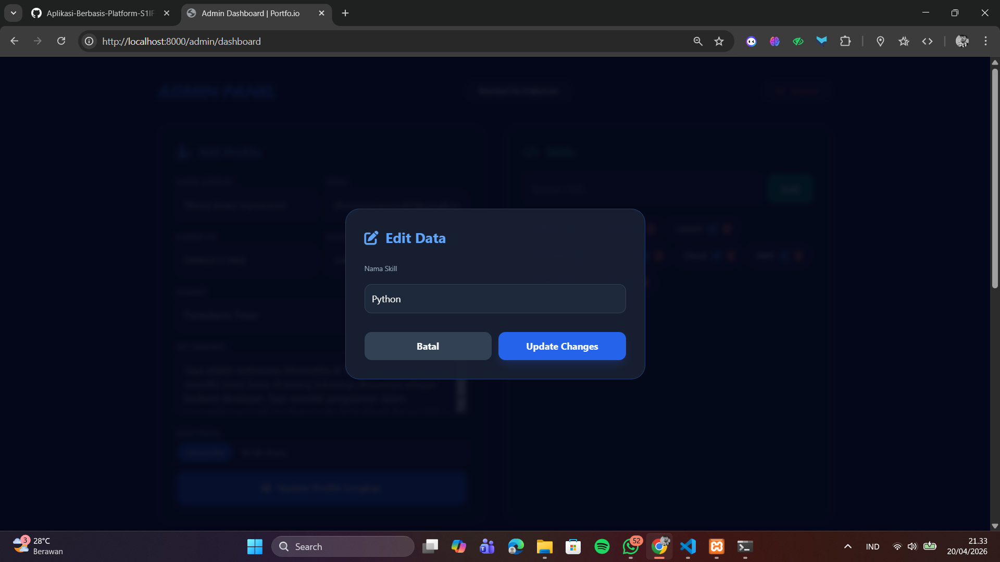
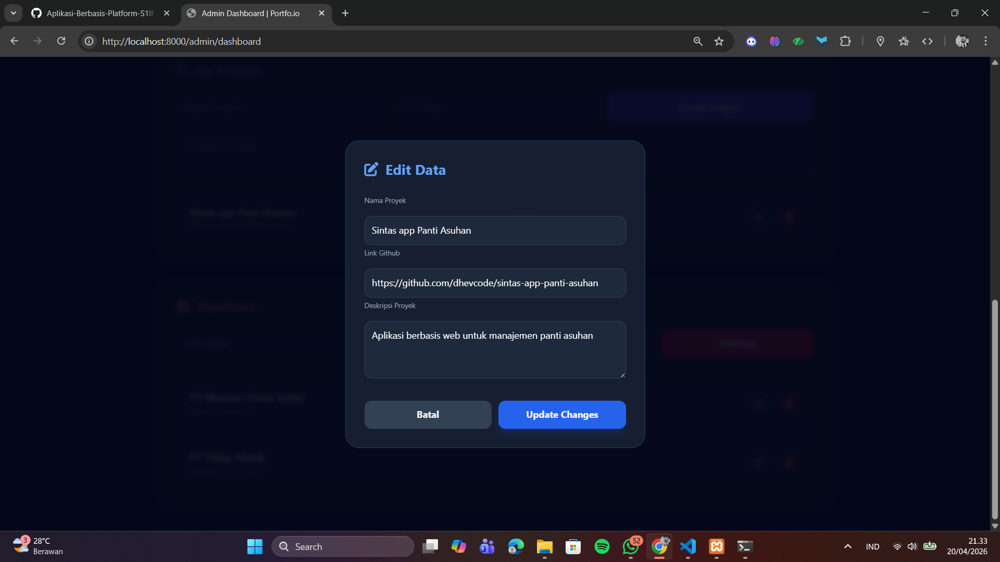
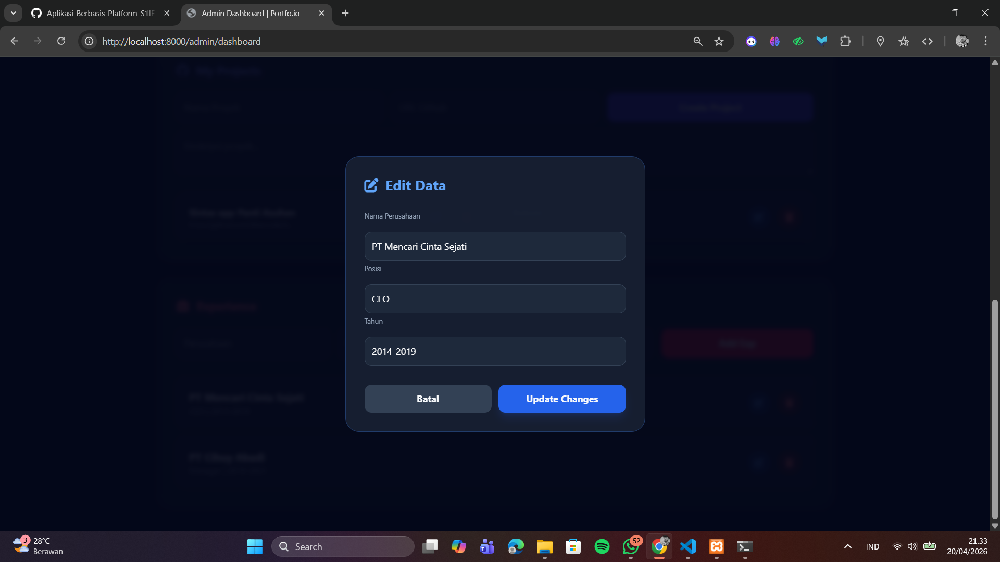

# LAPORAN UJIAN TENGAH SEMESTER (UTS) - PENGEMBANGAN APLIKASI WEB
**Nama:** Dheva Dewa Septiantoni  
**Kelas:** IF-11-01  
**Proyek:** Sistem Portofolio Dinamis Berbasis Laravel & AJAX

---

## 1. Deskripsi Proyek
Proyek ini adalah sebuah aplikasi web **Portofolio Personal Dinamis**. Aplikasi ini dirancang untuk menampilkan profil profesional, daftar keahlian (*skills*), riwayat pengalaman (*experiences*), dan daftar proyek (*projects*) milik pengguna.

Berbeda dengan portofolio statis, aplikasi ini memiliki sisi **Admin Dashboard** yang memungkinkan pengguna untuk mengelola data secara langsung tanpa menyentuh kode program. Sistem ini juga mengimplementasikan pemisahan antara *frontend* yang interaktif dan *backend* yang aman.

---

## 2. Teknologi yang Digunakan
Pembangunan aplikasi ini memanfaatkan ekosistem web modern:
* **Framework Backend:** Laravel (PHP) sebagai fondasi utama (Routing, Controller, Eloquent ORM).
* **Database:** MySQL untuk penyimpanan data relasional.
* **Frontend Styling:** Tailwind CSS untuk desain modern dan responsif.
* **Interaktivitas:** jQuery & AJAX untuk memuat data secara asinkron tanpa *reload* halaman.
* **Keamanan:** Middleware Authentication (Auth) untuk melindungi area sensitif.
* **Ikon & Font:** FontAwesome 6 dan Google Fonts.

---

## 3. Logika Pemrograman
Aplikasi ini mengikuti pola arsitektur **MVC (Model-View-Controller)**. Berikut adalah penjelasan komponen-komponen utamanya:

### A. Routing (`routes/web.php`)
Logika routing memisahkan antara akses publik dan akses admin yang dilindungi.
```php
// Route Publik (Akses Landing Page)
Route::get('/', [PortfolioController::class, 'index']);
Route::get('/api/portfolio-data', [PortfolioController::class, 'getApiData']);

// Route Terproteksi (Hanya Admin yang Login)
Route::middleware(['auth'])->prefix('admin')->group(function () {
    Route::get('/dashboard', [PortfolioController::class, 'adminDashboard'])->name('admin.dashboard');
    Route::put('/profile/update/{id}', [PortfolioController::class, 'updateProfile'])->name('profile.update');
    // ... CRUD Skill, Project, Experience
});
```
### B. Controller (`PortfolioController.php`)
Controller menangani permintaan data dan logika bisnis. Salah satu bagian penting adalah fungsi getApiData() yang melayani permintaan AJAX.
```php
public function getApiData()
{
    return response()->json([
        'success' => true,
        'profile' => Profile::first(),
        'skills'  => Skill::all(),
        'projects' => Project::orderBy('created_at', 'desc')->get(),
        'experiences' => Experience::orderBy('tahun', 'desc')->get()
    ]);
}
```
### C. Logika AJAX di View (`welcome.blade.php`)
Data dari database ditampilkan ke Landing Page menggunakan AJAX untuk memberikan pengalaman pengguna yang cepat (Single Page Experience).
```JavaScript
$.ajax({
    url: '/api/portfolio-data',
    type: 'GET',
    success: function(res) {
        if(res.success) {
            $('#user-name').text(res.profile.nama);
            $('#user-school').text(res.profile.sekolah);
            // Injeksi data ke HTML secara dinamis
        }
    }
});
```
## 4. Dokumentasi API
Sistem menyediakan API internal yang menghasilkan data dalam
format JSON.
* Endpoint: /api/portfolio-data
* Method: GET
* Struktur Respon:
```json
{
  "success": true,
  "profile": { "nama": "Dheva Dewa Septiantoni", "sekolah": "Telkom University", ... },
  "skills": [...],
  "projects": [...],
  "experiences": [...]
}
```
## 5. Fitur-Fitur Aplikasi
1. Frontend Dinamis: Data dimuat tanpa refresh menggunakan AJAX.
2. Authentication: Halaman login khusus untuk melindungi akses dashboard.
3. Full CRUD Management: Menambah, mengubah, dan menghapus Skill, Project, serta Experience.
4. Profile Management: Mengubah info profil, alamat, nomor HP, hingga foto secara real-time.
5. Dark Mode UI: Tampilan dashboard yang elegan dan modern untuk meminimalisir kelelahan mata.
6. Responsive Design: Tampilan dapat menyesuaikan ukuran layar (Mobile & Desktop)

## 6. Screenshot Program
1. Landing Page (Hero Section): Menampilkan profil lengkap dengan ikon sosial media.




2. Halaman Login: Antarmuka masuk untuk admin dengan tema Dark Mode.


3. Admin Dashboard: Tampilan manajemen data (Skill, Project, Experience).



4. Modal Edit: Tampilan saat mengubah data melalui jendela pop-up.



## 7. Kesimpulan
Pembuatan aplikasi portofolio ini membuktikan bahwa penggunaan framework Laravel sangat efektif dalam membangun sistem yang aman dan terstruktur. Dengan integrasi AJAX, aplikasi tidak hanya berfungsi sebagai media informasi, tetapi juga memberikan pengalaman navigasi yang lancar bagi pengunjung. Fitur autentikasi dan CRUD yang lengkap memastikan bahwa data dapat dikelola secara mandiri dengan tingkat keamanan yang baik.
