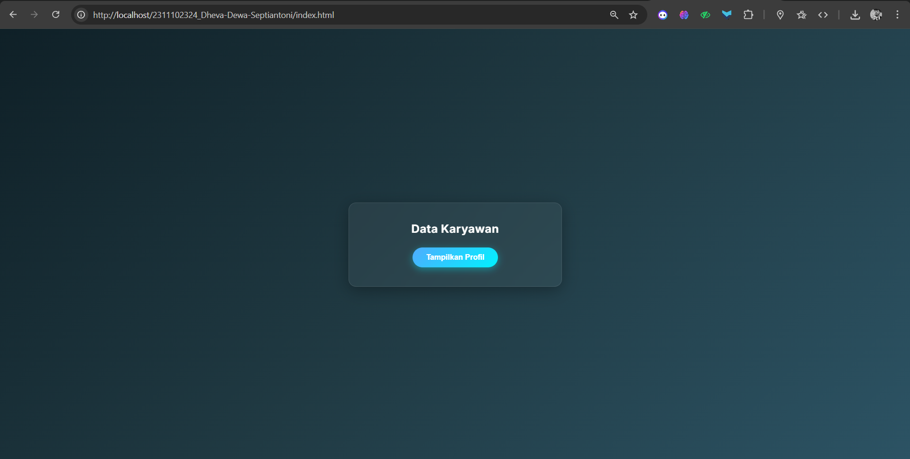
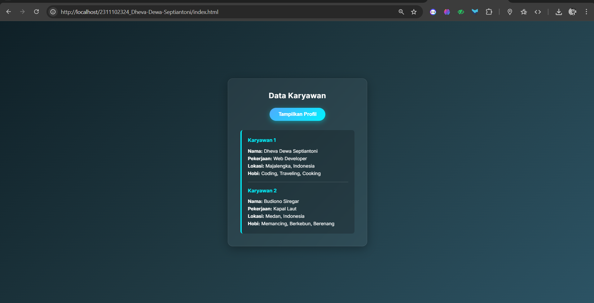

<div align="center">
   <h2>LAPORAN PRAKTIKUM<br>APLIKASI BERBASIS PLATFORM</h2>
   <h>
   <br>
   <h4>MODUL 10<br>AJAX</h4>
   <br>
   
   <br><br>
 
**Disusun Oleh :**<br>
Dheva Dewa Septiantoni<br>
2311102324<br>
IF-11-01
<br><br>
 
**Dosen Pengampu :**<br>
Dimas Fanny Hebrasianto Permadi, S.ST., M.Kom
<br><br>
 
**Assisten Praktikum :**<br>
Apri Pandu Wicaksono
<br>Rangga Pradarrell Fathi
<br><br>
 
PROGRAM STUDI S1 TEKNIK INFORMATIKA<br>
FAKULTAS INFORMATIKA<br>
UNIVERSITAS TELKOM PURWOKERTO<br>
2026

</div>

---

## 1. Dasar Teori

**AJAX (Asynchronous JavaScript and XML)** adalah teknik pengembangan web yang memungkinkan pertukaran data dengan server di latar belakang. Dengan teknik ini, sebagian elemen halaman web dapat diperbarui tanpa harus memuat ulang (reload) keseluruhan halaman.

**JSON (JavaScript Object Notation)** adalah format pertukaran data standar yang ringan dan mudah diproses. Dalam PHP, data tipe array dikonversi menjadi format JSON menggunakan fungsi json_encode(). Agar respons dikenali sebagai JSON dan bukan HTML, perlu ditambahkan instruksi header('Content-Type: application/json') pada sisi server.

**Fetch API** adalah fitur bawaan JavaScript modern untuk melakukan request data HTTP secara asinkron. Fetch berjalan berbasis Promise (.then() dan .catch()), menjadikannya alternatif yang lebih bersih dan terstruktur dibandingkan metode lama seperti XMLHttpRequest.

**Event Handling dan Manipulasi DOM** adalah Interaksi pengguna, seperti mengklik tombol, ditangkap menggunakan Event Handling (contoh: addEventListener). Setelah AJAX berhasil mengambil respons JSON, JavaScript menggunakan teknik manipulasi DOM (seperti property innerHTML) untuk menyuntikkan dan menampilkan data tersebut ke dalam elemen HTML yang dituju secara dinamis.

## 2. Kode Program Unguided

_Tugas Modul 10 - Ajax_

Buat sebuah halaman web yang bisa mengambil data dari server lalu menampilkannya di halaman tanpa perlu reload.

_Instruksi Detail:_

1. _Membuat File Server_ (data.php)
   Buat file PHP yang berfungsi sebagai“database sederhana”.
   Data cukup berupa array (misalnya: nama, pekerjaan, lokasi).
   Contoh data:
   `['nama' => 'Budi', 'pekerjaan' => 'Web Developer', 'lokasi' => 'Jakarta']`
   Ubah data tersebut menjadi format JSON menggunakan `json_encode()`.
   Tampilkan hasilnya dengan `echo`.
   Jangan lupa tambahkan header: `header('Content-Type: application/json');`

2. _Membuat File Client_ (index.html)
   Buat tombol dengan teks "Tampilkan Profil".
   Siapkan tempat untuk menampilkan data, misalnya:
   `<div id="hasil-profil"></div>`
3. _Membuat Logika AJAX (JavaScript)_
   Tambahkan event ketika tombol diklik.
   Gunakan fetch() (atau boleh pakai XMLHttpRequest / jQuery AJAX) untuk mengambil data dari data.php.
   Ambil hasil response dalam bentuk JSON.

Tampilkan data tersebut ke dalam `<div id="hasil-profil">` dengan format:
_Nama: Budi | Pekerjaan: Web Developer | Lokasi: Jakarta_

### Kode HTML (index.html)

```html
<!DOCTYPE html>
<html lang="id">
<head>
    <meta charset="UTF-8">
    <meta name="viewport" content="width=device-width, initial-scale=1.0">
    <title>Profil Developer - AJAX</title>
    <link href="https://fonts.googleapis.com/css2?family=Inter:wght@400;600;700&display=swap" rel="stylesheet">
    <style>
        * {
            margin: 0;
            padding: 0;
            box-sizing: border-box;
        }

        body {
            font-family: 'Inter', sans-serif;
            background: linear-gradient(135deg, #0f2027, #203a43, #2c5364);
            color: #ffffff;
            height: 100vh;
            display: flex;
            justify-content: center;
            align-items: center;
        }

        .card-container {
            background-color: rgba(255, 255, 255, 0.05);
            backdrop-filter: blur(10px);
            border: 1px solid rgba(255, 255, 255, 0.1);
            border-radius: 16px;
            padding: 40px;
            width: 100%;
            max-width: 450px;
            text-align: center;
            box-shadow: 0 8px 32px rgba(0, 0, 0, 0.3);
            transition: transform 0.3s ease;
        }

        .card-container:hover {
            transform: translateY(-5px);
        }

        h2 {
            font-size: 24px;
            margin-bottom: 25px;
            font-weight: 700;
            letter-spacing: 0.5px;
        }

        button {
            background: linear-gradient(135deg, #4facfe 0%, #00f2fe 100%);
            color: white;
            border: none;
            padding: 12px 28px;
            font-size: 16px;
            font-weight: 600;
            border-radius: 30px;
            cursor: pointer;
            box-shadow: 0 4px 15px rgba(0, 242, 254, 0.4);
            transition: all 0.3s ease;
            outline: none;
        }

        button:hover {
            box-shadow: 0 6px 20px rgba(0, 242, 254, 0.6);
            transform: scale(1.05);
        }

        button:active {
            transform: scale(0.95);
        }

        #hasil-profil {
            margin-top: 30px;
            padding: 20px;
            background-color: rgba(0, 0, 0, 0.2);
            border-left: 4px solid #00f2fe;
            border-radius: 8px;
            font-size: 15px;
            line-height: 1.6;
            display: none; 
            text-align: left;
            animation: fadeIn 0.5s ease forwards;
        }

        @keyframes fadeIn {
            from { opacity: 0; transform: translateY(10px); }
            to { opacity: 1; transform: translateY(0); }
        }

        .error-text {
            color: #ff6b6b;
            border-left-color: #ff6b6b !important;
        }
    </style>
</head>
<body>

    <div class="card-container">
        <h2>Data Karyawan</h2>
        
        <button id="btn-tampil">Tampilkan Profil</button>

        <div id="hasil-profil"></div>
    </div>

    <script>
        const btnTampil = document.getElementById('btn-tampil');
        const hasilProfil = document.getElementById('hasil-profil');

        btnTampil.addEventListener('click', function() {
            
            // Efek loading pada tombol
            const originalText = btnTampil.innerHTML;
            btnTampil.innerHTML = 'Mengambil data...';
            btnTampil.style.pointerEvents = 'none';

            fetch('data.php')
                .then(response => {
                    if (!response.ok) {
                        throw new Error('Terjadi kesalahan pada jaringan/server.');
                    }
                    return response.json(); 
                })
                .then(data => {
                    btnTampil.innerHTML = originalText;
                    btnTampil.style.pointerEvents = 'auto';

                    hasilProfil.innerHTML = '';

                    data.forEach((profil, index) => {
                        hasilProfil.innerHTML += `
                            <div style="margin-bottom: 15px; padding-bottom: 15px; border-bottom: 1px solid rgba(255, 255, 255, 0.2);">
                                <h3 style="font-size: 16px; margin-bottom: 10px; color: #00f2fe;">Karyawan ${index + 1}</h3>
                                <strong>Nama:</strong> ${profil.nama} <br> 
                                <strong>Pekerjaan:</strong> ${profil.pekerjaan} <br> 
                                <strong>Lokasi:</strong> ${profil.lokasi} <br>
                                <strong>Hobi:</strong> ${profil.hobi.join(', ')}
                            </div>
                        `;
                    });

                    hasilProfil.lastElementChild.style.borderBottom = 'none';
                    hasilProfil.lastElementChild.style.marginBottom = '0';
                    hasilProfil.lastElementChild.style.paddingBottom = '0';

                    hasilProfil.classList.remove('error-text');
                    hasilProfil.style.display = 'block'; 
                })
                .catch(error => {
                    console.error('Error:', error);
                    btnTampil.innerHTML = originalText;
                    btnTampil.style.pointerEvents = 'auto';
                    
                    hasilProfil.innerHTML = 'Gagal mengambil data. Pastikan file dijalankan di dalam server lokal (XAMPP/Laragon).';
                    hasilProfil.classList.add('error-text');
                    hasilProfil.style.display = 'block';
                });
        });
    </script>

</body>
</html>
```

### Kode PHP (data.php)

```php
<?php
// Set header agar browser mengenali output ini sebagai JSON
header('Content-Type: application/json');

// Membuat database sederhana menggunakan array asosiatif
$data = [
    [
        'nama' => 'Dheva Dewa Septiantoni',
        'pekerjaan' => 'Web Developer',
        'lokasi' => 'Majalengka, Indonesia',
        'hobi' => ['Coding', 'Traveling', 'Cooking']
    ],
    [
        'nama' => 'Budiono Siregar',
        'pekerjaan' => 'Kapal Laut',
        'lokasi' => 'Medan, Indonesia',
        'hobi' => ['Memancing', 'Berkebun', 'Berenang']
    ]
];

echo json_encode($data);
?>
```

### Hasil Output




### Penjelasan Kode PHP (data.php)

1. Penjelasan data.php (Bagian Server / Backend)
File ini bertindak sebagai penyedia data (sering disebut sebagai API sederhana). Tugasnya hanya satu: memberikan data yang bisa dibaca oleh JavaScript.<br>
header(`Content-Type: application/json`);
Ini adalah baris yang sangat penting. Perintah ini memberi tahu browser atau aplikasi yang meminta data bahwa "Konten yang saya kirimkan ini adalah JSON, bukan teks biasa atau HTML". Tanpa ini, JavaScript di file klien mungkin akan kesulitan membaca datanya.<br>
`$data = [ ... ]`;
Di sini kita membuat sebuah Array Asosiatif di PHP yang berisi data profil (nama, pekerjaan, lokasi). Dalam aplikasi nyata, data ini biasanya diambil dari database (seperti MySQL), namun di sini kita menuliskannya secara manual (statik) sebagai contoh.<br>
echo `json_encode($data)`;
JavaScript tidak mengerti format Array PHP. Oleh karena itu, fungsi `json_encode()` digunakan untuk menerjemahkan Array PHP tersebut menjadi format teks JSON (JavaScript Object Notation). Setelah diterjemahkan, perintah echo akan mencetaknya/mengirimkannya ke klien.

2. Penjelasan index.html (Bagian Client / Frontend)
File ini adalah antarmuka yang dilihat oleh pengguna. Di dalamnya terdapat HTML untuk kerangka, CSS untuk desain, dan JavaScript (AJAX) untuk mengambil data.<br>
Bagian JavaScript (Logika AJAX):<br>
Ini adalah inti dari proses pengambilan data tanpa reload.<br>
Menangkap Elemen:
`document.getElementById` digunakan untuk mengenali tombol (btnTampil) dan kotak tempat hasil akan dimunculkan (hasilProfil).<br>
Event Listener (`addEventListener`):
Kita memasang "pendengar" pada tombol. Ketika tombol diklik ('click'), semua kode di dalam fungsi tersebut akan dijalankan.<br>
Proses fetch():
Ini adalah fungsi bawaan JavaScript modern untuk melakukan AJAX.<br>
fetch(`data.php`): JavaScript pergi "mengetuk pintu" file data.php di latar belakang.<br>
`.then(response => response.json())`: Ketika data.php menjawab, JavaScript akan menerima respons tersebut dan langsung menerjemahkannya sebagai format JSON agar bisa diolah.<br>
`.then(data => { ... })`: Setelah datanya matang dan berbentuk objek JavaScript (data), kita mengambil bagian-bagiannya seperti data.nama dan menyisipkannya ke dalam elemen HTML (hasilProfil.innerHTML). Terakhir, kita mengubah display: block agar kotak profil yang tadinya tersembunyi menjadi terlihat.<br>
`.catch(error => { ... })`: Ini adalah jaring pengaman. Jika file data.php tidak ditemukan, atau server mati, kode ini akan menangkap error-nya dan menampilkan pesan gagal kepada pengguna agar halaman tidak sekadar blank.

Bagian CSS (Desain):

Flexbox: Pada tag body, perintah `display: flex;` `justify-content: center; align-items: center;` digunakan agar kotak profil berada persis di tengah-tengah layar secara vertikal dan horizontal.

Glassmorphism: Efek kartu tembus pandang dibuat menggunakan `background-color: rgba(...)` dikombinasikan dengan `backdrop-filter: blur(10px)`.

Animasi: `@keyframes fadeIn` digunakan pada #hasil-profil agar saat data berhasil diambil, teksnya muncul dengan gaya meluncur halus dari bawah ke atas.

Alur Kerja Singkat:
Kamu klik tombol "Tampilkan Profil".

JavaScript (fetch) berlari ke server meminta data.php.

data.php membungkus array menjadi JSON dan memberikannya ke JavaScript.

JavaScript menerima JSON tersebut, memecahnya, lalu menempelkan nama, pekerjaan, dan lokasi ke dalam layar HTML secara instan.

## 3. Kesimpulan dan Penutup

Modul ini menjelaskan konsep dasar dan implementasi AJAX beserta Fetch API untuk melakukan pertukaran data antara client dan server secara asinkron, dengan fokus materi pada pembuatan server API sederhana menggunakan PHP, pengolahan format data JSON, penanganan event, hingga manipulasi DOM tanpa perlu memuat ulang halaman (reload). Cocok digunakan sebagai panduan pembelajaran praktikum pemrograman web bagi mahasiswa program studi S1 Teknik Informatika untuk membangun situs web modern yang interaktif, cepat, dan responsif.

## 4. Referensi

- [Materi Modul 10](https://drive.google.com/drive/folders/1ug7dmm-aVF-NG9-YT5kT519HdGmkXaD-?usp=sharing)
- [Fetch API (AJAX Asinkron)](https://developer.mozilla.org/en-US/docs/Web/API/Fetch_API/Using_Fetch)
- [Async/await](https://developer.mozilla.org/en-US/docs/Learn/JavaScript/Asynchronous/Promises)