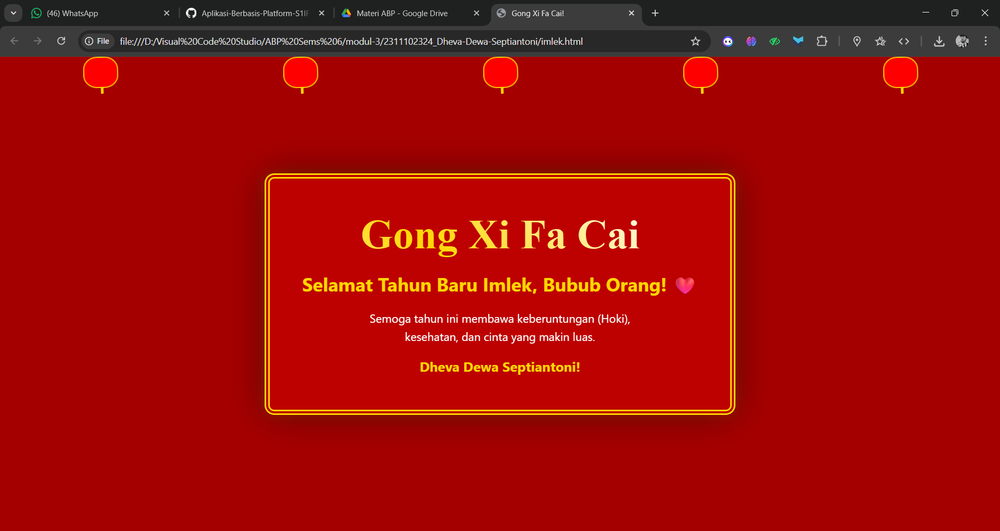

<div align="center">
  <h3>LAPORAN PRAKTIKUM<br>APLIKASI BERBASIS PLATFORM</h3>
  <h>
  <br>
  <h3>MODUL 2<br>HTML</h3>
  <br>
  
  <br>
  <br>

**Disusun Oleh :**<br>
Dheva Dewa Septiantoni<br>
2311102324<br>
IF-11-01
<br>
<br>

**Dosen Pengampu :**<br>
Dimas Fanny Hebrasianto Permadi, S.ST., M.Kom
<br>
<br>

**Assisten Praktikum :**<br>
Apri Pandu Wicaksono<br>
Rangga Pradarrell Fathi
<br>
<br>

PROGRAM STUDI S1 TEKNIK INFORMATIKA<br>
FAKULTAS INFORMATIKA<br>
UNIVERSITAS TELKOM PURWOKERTO<br>
2026

</div>

---

## 1. Dasar Teori

**CSS (Cascading Style Sheet)** adalah bahasa pendamping HTML yang berfungsi untuk mendesain, mengatur, dan membentuk tampilan pada sebuah halaman website. Jika HTML diibaratkan sebagai kerangka dari sebuah bangunan, maka CSS adalah cat, dekorasi, tata letak, dan desain interior yang memperindah bangunan tersebut.

CSS bekerja dengan cara memilih elemen HTML menggunakan *selektor* (seperti tag, *class*, atau *id*) lalu menerapkan aturan gaya padanya (properti warna, ukuran, posisi, dsb). Penggunaan CSS memungkinkan para pengembang web untuk memisahkan antara konten (HTML) dan desain visual (CSS), sehingga kode menjadi lebih bersih dan mudah dipelihara.

Terdapat tiga cara umum untuk menambahkan CSS ke dalam HTML:
1. **Inline CSS:** Menuliskan gaya langsung pada elemen HTML menggunakan atribut `style`.
2. **Internal CSS:** Mendeklarasikan aturan gaya di dalam blok `<style>` yang berada di dalam tag `<head>` dokumen.
3. **External CSS:** Menempatkan seluruh aturan gaya dalam file terpisah berekstensi `.css`, kemudian menghubungkannya dengan tag `<link>` di dalam file HTML. Pendekatan ini adalah *best practice* untuk proyek berskala besar karena memisahkan struktur dan tampilan secara bersih.

Konsep CSS lain yang dipakai dalam praktikum ini:
- **Pseudo-elemen (`::before`, `::after`):** Menyisipkan konten dekoratif sebelum atau sesudah elemen tanpa menambah markup HTML.
- **`z-index`:** Mengatur urutan tumpukan (*stacking order*) elemen yang saling bertindih.
- **`filter`:** Memberikan efek visual seperti bayangan, blur, atau saturasi warna pada elemen.
- **`:nth-child()`:** Selektor yang memilih elemen berdasarkan urutannya di antara saudara-saudara elemennya.

---

## 2. Penjelasan Kode HTML dan CSS

Berikut ini adalah implementasi desain kartu ucapan Imlek yang menggabungkan struktur HTML murni dan desain visual modern dari *External CSS*, beserta hasil tampilannya.

### Kode HTML (`imlek.html`)

```html
<!DOCTYPE html>
<html lang="id">
<head>
    <meta charset="UTF-8">
    <meta name="viewport" content="width=device-width, initial-scale=1.0">
    <title>Gong Xi Fa Cai!</title>
    <link rel="stylesheet" href="style.css">
</head>
<body>

    <div class="lampion-container">
        <div class="lampion"></div>
        <div class="lampion"></div>
        <div class="lampion"></div>
        <div class="lampion"></div>
        <div class="lampion"></div>
    </div>

    <div class="card">
        <div class="oriental-pattern"></div>
        <h1 class="shine">Gong Xi Fa Cai</h1>
        <p class="greeting">Selamat Tahun Baru Imlek, Bubub Orang! ❤️</p>
        <div class="message">
            Semoga tahun ini membawa keberuntungan (Hoki), <br>
            kesehatan, dan cinta yang makin luas. <br>
            <span class="gold-text">Dheva Dewa Septiantoni</span>
        </div>
    </div>

</body>
</html>
```

### Kode CSS (`style.css`)

```css
body {
    background-color: #a50000; 
    margin: 0;
    height: 100vh;
    display: flex;
    justify-content: center;
    align-items: center;
    font-family: 'Segoe UI', Roboto, Helvetica, Arial, sans-serif;
    overflow: hidden;
}


.card {
    background-color: #bd0000;
    padding: 50px;
    border: 8px double #ffd700; 
    border-radius: 15px;
    text-align: center;
    box-shadow: 0 0 50px rgba(0, 0, 0, 0.5), 0 0 20px rgba(255, 215, 0, 0.2);
    position: relative;
    max-width: 80%;
}


h1 {
    font-size: 4rem;
    margin: 0;
    background: linear-gradient(45deg, #ffd700, #fff, #ffd700, #fff);
    background-size: 200% auto;
    -webkit-background-clip: text;
    -webkit-text-fill-color: transparent;
    animation: shine 3s linear infinite;
    font-family: serif;
}

.greeting {
    color: #ffd700;
    font-size: 1.8rem;
    font-weight: bold;
    margin: 20px 0;
}

.message {
    color: #fff;
    line-height: 1.6;
    font-size: 1.1rem;
}

.gold-text {
    color: #ffd700;
    display: block;
    margin-top: 15px;
    font-weight: bold;
    font-size: 1.3rem;
}


.lampion-container {
    position: absolute;
    top: 0;
    width: 100%;
    display: flex;
    justify-content: space-around;
}

.lampion {
    width: 50px;
    height: 45px;
    background: #ff0000;
    border: 2px solid #ffd700;
    border-radius: 40%;
    position: relative;
    animation: swing 3s ease-in-out infinite alternate;
    transform-origin: top center;
}

.lampion::before {
    content: "";
    position: absolute;
    top: -10px;
    left: 50%;
    width: 2px;
    height: 10px;
    background: #ffd700;
}

.lampion::after {
    content: "";
    position: absolute;
    bottom: -10px;
    left: 50%;
    width: 4px;
    height: 10px;
    background: #ffd700;
}


@keyframes shine {
    to { background-position: 200% center; }
}

@keyframes swing {
    from { transform: rotate(-15deg); }
    to { transform: rotate(15deg); }
}
```

### Hasil Tampilan (Screenshot)



### Penjelasan code:

1. Struktur HTML (index.html)
`<link rel="stylesheet" href="style.css">`: Digunakan untuk menghubungkan file HTML dengan file CSS eksternal. Ini memisahkan struktur konten dengan desain visual agar kode lebih rapi.<br>
lampion-container: Berfungsi sebagai wadah untuk elemen dekorasi lampion. Di dalamnya terdapat beberapa div lampion yang akan dianimasikan.<br>
card: Merupakan kontainer utama (pembungkus) pesan ucapan. Struktur ini digunakan agar teks berada dalam satu blok yang solid di tengah layar.<br>
shine: Sebuah class khusus yang diterapkan pada tag `<h1>` untuk memberikan efek teks berkilau emas.

2. Logika Desain CSS (style.css)
Desain ini berfokus pada penggunaan Flexbox dan CSS Animation untuk menghidupkan suasana halaman.<br>
A. Layouting (Flexbox)
CSS<br>
`display: flex`;<br>
`justify-content: center;`<br>
`align-items: center;`<br>
`height: 100vh;`<br>
Bagian ini memastikan seluruh konten berada tepat di tengah layar (baik secara horizontal maupun vertikal) di semua ukuran layar browser.<br>
<br>
B. Teknik Animasi<br>
Lampion Swing `@keyframes swing`:<br>
Menggunakan properti transform: `rotate()`. Dengan memberikan `transform-origin: top center`, lampion seolah-olah tergantung pada sebuah tali dan berayun ke kiri dan kanan secara terus-menerus menggunakan fungsi infinite alternate.<br>
Gold Shine Effect `@keyframes shine`:<br>
Efek ini dibuat dengan menumpuk gradasi warna emas (linear-gradient) pada teks, lalu menggerakkan posisi latar belakang tersebut `(background-position)` secara berulang sehingga teks terlihat mengkilap seperti logam.<br>
<br>
C. Styling Visual
Double Border: Penggunaan `border: 8px double #ffd700` memberikan kesan bingkai klasik yang identik dengan kartu ucapan Tionghoa tradisional.<br>
Shadowing: Penggunaan `box-shadow` memberikan efek kedalaman (depth) agar kartu ucapan terlihat "melayang" di atas latar belakang merah.

## Refrensi
- [Materi Modul 3](https://drive.google.com/file/d/1kd7ogQkR_rsNCnKDcJDmavY8FiOyTLzs/view?usp=sharing)
- [MDN Web Docs — CSS Pseudo-elements](https://developer.mozilla.org/en-US/docs/Web/CSS/Pseudo-elements)
- [MDN Web Docs — CSS filter](https://developer.mozilla.org/en-US/docs/Web/CSS/filter)
- [Google Fonts — Cinzel & Dancing Script](https://fonts.google.com/)