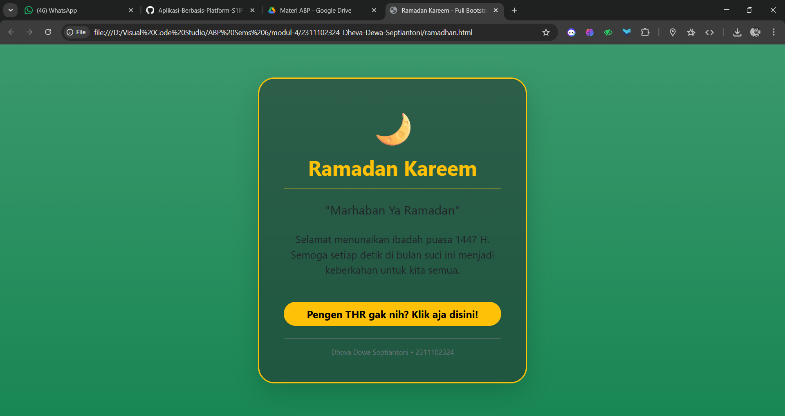

<div align="center">
   <h2>LAPORAN PRAKTIKUM<br>APLIKASI BERBASIS PLATFORM</h2>
   <h>
   <br>
   <h4>MODUL 4<br>BOOTSTRAP</h4>
   <br>
   
   <br><br>
 
**Disusun Oleh :**<br>
Dheva Dewa Septiantoni<br>
2311102324<br>
IF-11-01
<br><br>
 
**Dosen Pengampu :**<br>
Dimas Fanny Hebrasianto Permadi, S.ST., M.Kom
<br><br>
 
**Assisten Praktikum :**<br>
Apri Pandu Wicaksono
<br>Rangga Pradarrell Fathi
<br><br>
 
PROGRAM STUDI S1 TEKNIK INFORMATIKA<br>
FAKULTAS INFORMATIKA<br>
UNIVERSITAS TELKOM PURWOKERTO<br>
2026

</div>

---

## 1. Dasar Teori

**Bootstrap** merupakan sebuah front-end framework gratis untuk pengembangan antar muka web yang lebih cepat dan lebih mudah. Dikembangkan oleh Mark Otto dan Jacom Thornton di Twitter dan dirilis sebagai produk open source pada Agustus 2011 di GitHub. Bootstrap mencakup template desain berbasis HTML dan CSS untuk tipografi, form, button, navigasi, modal, image carousells dan masih banyak lagi, serta terdapat opsional plugin JavaScript. Selain itu, Bootstrap memiliki kemampuan untuk membuat desain responsif yang secara otomatis menyesuaikan diri agar terlihat baik di segala perangkat, mulai dari perangkat ponsel hingga desktop pc.

**Pemasangan Bootstrap** Pemasangan dapat dilakukan dengan mengunduh file secara lokal atau memanggil Bootstrap CDN (Content Delivery Network). Penggunaan metode CDN tidak mengharuskan pengunduhan file ke dalam proyek web, namun membutuhkan koneksi internet untuk menghasilkan perubahan tampilan CSS.

**Bootstrap Container** Merupakan elemen paling dasar yang dibutuhkan dalam layouting menggunakan Bootstrap Grid. Terdapat dua class utama, yaitu `.container` untuk lebar tetap yang responsif, dan `.container-fluid` untuk lebar penuh mencakup seluruh area pandang.

**Bootstrap Grid** Sistem ini menggunakan rangkaian container, row (baris), dan column (kolom) untuk tata letak konten. Sistem grid dibangun dengan flexbox dan membagi halaman maksimal menjadi 12 kolom. Penggunaan kolom disesuaikan dengan ukuran layar menggunakan class seperti `.col-`, `.col-sm`-, `.col-md-`,` .col-lg-`, dan `.col-xl-`.

**Text Style** yaitu Bootstrap menyediakan berbagai class untuk mengatur gaya teks, seperti `.text-center` (rata tengah), `.text-uppercase` (huruf kapital semua), dan `.fw-bold` (huruf tebal).

**Bootstrap Table** yaitu Tabel dipanggil menggunakan class default `.table`. Tampilan tabel dapat dimodifikasi dengan class tambahan seperti `.table-hover` (warna baris berubah saat disorot) atau `.table-dark` (latar belakang gelap).

**Bootstrap Image** yaitu Penambahan class `.img-fluid` pada elemen HTML `img` membuat ukuran gambar menjadi responsif menyesuaikan ukuran container atau wadahnya.

**Bootstrap Button** Tampilan tombol standar `.btn` dapat dirubah warna dan ukurannya dengan class tambahan seperti `.btn-primary` untuk desain utama atau `.btn-lg` untuk ukuran besar.

**Bootstrap Form** Class `.form-control` digunakan pada elemen input untuk memberikan styling yang konsisten. Tata letak form dapat diatur secara vertikal (default), inline (satu baris), atau horizontal (menggunakan sistem grid dengan class `.row` dan `.col-\*`).

## 2. Kode Program Unguided

Tugas 4, Buat halaman ramadan dan gunakan bootstrap (sebisa mungkin tanpa meggunakan native css full bootstap)

### Kode HTML (ramadhan.html)

```html
<!DOCTYPE html>
<html lang="id">
<head>
    <meta charset="UTF-8">
    <meta name="viewport" content="width=device-width, initial-scale=1.0">
    <title>Ramadan Kareem - Full Bootstrap</title>
    <link href="https://cdn.jsdelivr.net/npm/bootstrap@5.3.2/dist/css/bootstrap.min.css" rel="stylesheet">
</head>
<body class="bg-success bg-gradient vh-100 d-flex align-items-center justify-content-center text-white">

    <div class="container">
        <div class="row justify-content-center">
            <div class="col-11 col-sm-8 col-md-6 col-lg-5">
                
                <div class="card bg-dark bg-opacity-50 border border-warning border-3 shadow-lg rounded-5">
                    <div class="card-body text-center p-4 p-md-5">
                        
                        <div class="display-2 text-warning mb-3">🌙</div>
                        
                        <h1 class="fw-bold text-warning border-bottom border-warning pb-3 mb-4">
                            Ramadan Kareem
                        </h1>
                        
                        <blockquote class="blockquote mb-4">
                            <p class="fs-4 italic">"Marhaban Ya Ramadan"</p>
                        </blockquote>

                        <div class="mb-5">
                            <p class="fs-5 lh-base">
                                Selamat menunaikan ibadah puasa 1447 H. <br>
                                Semoga setiap detik di bulan suci ini menjadi keberkahan untuk kita semua.
                            </p>
                        </div>

                        <div class="d-grid gap-2">
                            <a href="#" class="btn btn-warning btn-lg rounded-pill fw-bold shadow-sm">
                                Pengen THR gak nih? Klik aja disini!
                            </a>
                        </div>

                        <div class="mt-4 pt-3 border-top border-secondary text-secondary small">
                            Dheva Dewa Septiantoni &bull; 2311102324
                        </div>

                    </div>
                </div>

            </div>
        </div>
    </div>

    <script src="https://cdn.jsdelivr.net/npm/bootstrap@5.3.2/dist/js/bootstrap.bundle.min.js"></script>
</body>
</html>
```

### Hasil Output



### Penjelasan Kode HTML

1. `bg-success bg-gradient`: Menggantikan background manual. Ini memberikan warna hijau khas Islami dengan sedikit gradasi agar tidak terlihat "flat".

2. `vh-100`: Mengatur tinggi halaman tepat 100% dari tinggi layar (Viewport Height) supaya konten bisa berada di tengah secara vertikal.

3. `bg-opacity-50`: Memberikan efek transparan pada kartu sehingga warna hijau background belakang masih tembus, memberikan kesan estetis tanpa properti `rgba()` manual.

4. `border-warning border-3`: Menggunakan warna kuning (warning) sebagai representasi warna emas pada bingkai kartu.

5. `rounded-5`: Memberikan lekukan sudut yang besar (khas desain modern) tanpa perlu border-radius.

6. `lh-base`: Mengatur jarak antar baris teks (line-height) agar lebih enak dibaca.

## 3. Kesimpulan dan Penutup

Modul ini menjelaskan tentang konsep dasar dan implementasi Bootstrap sebagai front-end framework untuk pengembangan antarmuka web yang lebih cepat dan responsif , dengan sistem grid, gaya teks, tabel, gambar, tombol, serta formulir sebagai fokus materi utamanya. Cocok digunakan sebagai panduan pembelajaran praktikum pemrograman web bagi mahasiswa program studi Informatika di Telkom University Purwokerto untuk membangun tata letak situs web portofolio yang modern dan rapi di berbagai perangkat.

## 4. Referensi

- [Materi Modul 4](https://drive.google.com/file/d/1Qxsa7wNn3PNrDLYzgBKb62GZi4mPkoub/view)