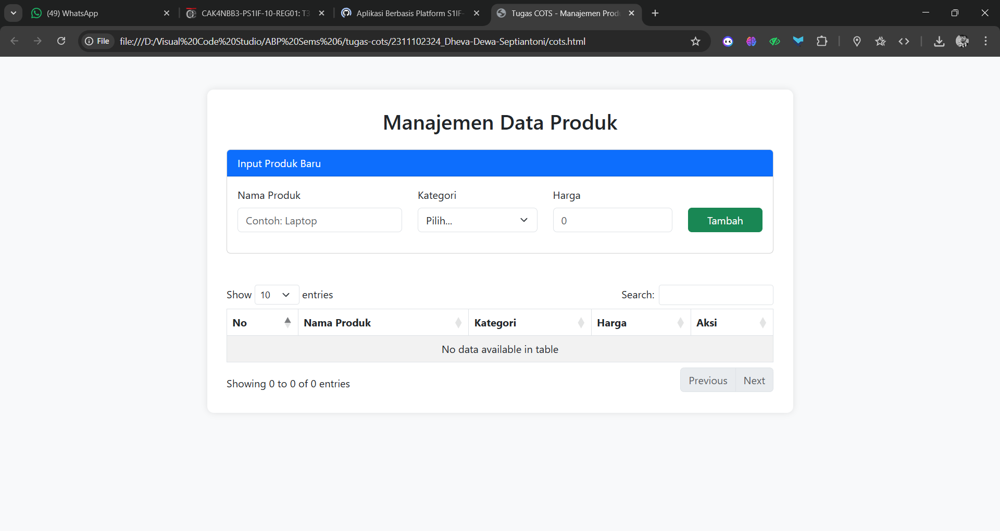
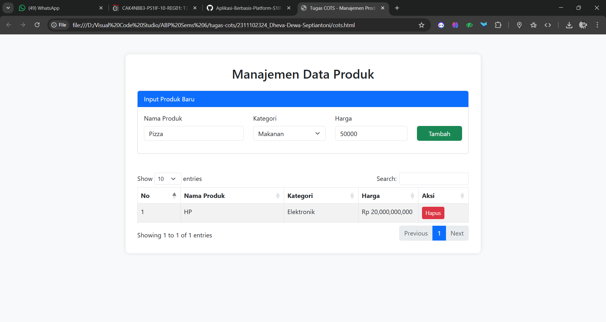
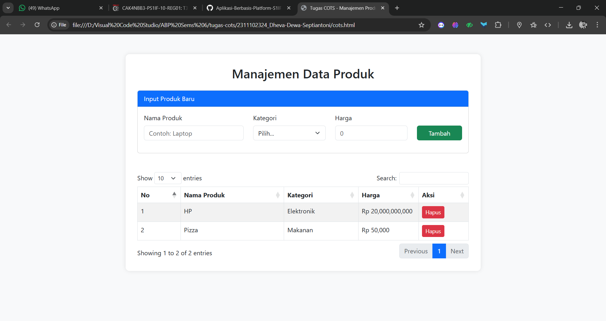

<div align="center">
   <h2>LAPORAN PRAKTIKUM<br>APLIKASI BERBASIS PLATFORM</h2>
   <h>
   <br>
   <h4>MODUL 5<br>JAVASCRIPT</h4>
   <br>
   
   <br><br>
 
**Disusun Oleh :**<br>
Dheva Dewa Septiantoni<br>
2311102324<br>
IF-11-01
<br><br>
 
**Dosen Pengampu :**<br>
Dimas Fanny Hebrasianto Permadi, S.ST., M.Kom
<br><br>
 
**Assisten Praktikum :**<br>
Apri Pandu Wicaksono
<br>Rangga Pradarrell Fathi
<br><br>
 
PROGRAM STUDI S1 TEKNIK INFORMATIKA<br>
FAKULTAS INFORMATIKA<br>
UNIVERSITAS TELKOM PURWOKERTO<br>
2026

</div>

---

## 1. Dasar Teori

**Javascript** merupakan bahasa pemrograman scripting yang digunakan untuk mengubah dokumen HTML statis menjadi dinamis dan interaktif, umumnya digunakan hanya untuk program yang tidak terlalu besar, biasanya hanya beberapa ratus baris, dan mengontrol program yang berbasis Java. Pada dasarnya Javascript tidak dirancang untuk digunakan dalam aplikasi skala besar.

**Prinsip Dasar Javascript** terdapat pada bahasa pemrograman javascript adalah sebagai berikut.

1. Javascript mendukung paradigma pemrograman imparatif (Javascript dapat menjalankan perintah program baris demi baris, dengan masing-masing baris berisi satu atau lebih perintah), fungsional (struktur dan elemen-elemen dalam program sebagai fungsi matematis yang tidak memiliki keadaan (state) dan data yang dapat berubah (mutable data)), dan orientasi objek (segala sesuatu yang terlibat dalam program dapat disebut sebagai "objek").
2. Javascript memiliki model pemrograman fungsional yang sangat ekspresif.
3. Pemrograman berorientasi objek (PBO) pada Javascript memiliki perbedaan dari PBO pada umumnya.
4. Program kompleks pada Javascript umumnya dipandang sebagai program-program kecil yang saling berinteraksi.

**Tipe data dasar** Seperti kebanyakan bahasa pemrograman lainnya, Javascript memiliki beberapa tipe data untuk dimanipulasi. Seluruh nilai yang ada dalam Javascript selalu memiliki tipe data. Tipe data yang dimiliki oleh
Javascript adalah sebagai berikut:
• Number (bilangan)
• String (serangkaian karakter)
• Boolean (benar / salah)
• Object
• Function (fungsi)
• Array
• Date
• RegExp (regular expression)
• Null (tidak berlaku / kosong)
• Undefined (tidak didefinisikan)

**Variabel** dideklarasikan dengan "var" dan tipe datanya dapat berubah secara dinamis. JavaScript memiliki tipe data seperti "Number", "String", "Boolean", "Object", "Function", "Array", "Date", "RegExp", "Null", dan "Undefined".

**Array** Tipe khusus (mirip objek) untuk menampung banyak nilai (termasuk beda tipe data) yang diakses menggunakan indeks mulai dari 0. Memiliki method bawaan seperti "push()", "pop()", dan properti "length".

**Pengendalian Struktur** Menggunakan "if"/"else" untuk percabangan serta "for", "while", dan "do-while" untuk perulangan. Evaluasi data yang paling akurat menggunakan operator "===" untuk memastikan tipe data dan nilai sama.

**Objek** Merupakan sekumpulan properti yang dapat berubah nilainya (mutable properties collection). Dibuat menggunakan kurung kurawal "{}" atau object literal. Nilai objek diakses menggunakan tanda kurung siku "[]" atau titik "." . Pewarisan objek pada JavaScript tidak menggunakan kelas, melainkan prototipe melalui fungsi "Object.create".

**Function** Digunakan untuk menyimpan perintah agar dapat digunakan ulang (code reuse) dan menyembunyikan informasi. Dapat dibuat dengan nama (function declaration) maupun tanpa nama / fungsi anonim (function expression). Fungsi mengembalikan nilai dan akan langsung berhenti bekerja ketika program menemukan kata kunci "return".

**Pengenalan dan Penggunaan jQuery** Library JavaScript ringan yang menyederhanakan manipulasi dokumen HTML hanya dengan beberapa baris kode. Memudahkan manipulasi DOM, penanganan event (seperti klik pengguna), dukungan AJAX, dan pembuatan animasi. Dapat diimplementasikan melalui file lokal (download) atau menggunakan Content Delivery Network (CDN). Mampu mengelola efek tampilan seperti menampilkan "show" atau menyembunyikan "hide" elemen HTML, serta menerapkan efek animasi seperti "toggle" Pada elemen.

## 2. Kode Program Unguided

_Tugas COTS_

_Pengumpulan sama seperti pertemuan kemarin di Github di repo COTS Deadline 16 Maret 2026_

Buatlah sebuah halaman web sederhana untuk menampilkan data produk. Pada halaman tersebut terdapat form input dan tabel data produk.

Ketentuan:

1. Gunakan Bootstrap untuk tampilan halaman.
2. Buat form input dengan data:

- Nama Produk
- Kategori
- Harga

6. Data yang diinput dari form harus ditampilkan pada tabel.
7. Gunakan JQuery Datatable pada tabel.
8. Tambahkan tombol hapus pada setiap data di tabel.
9. Pastikan tabel memiliki fitur search dan pagination.
10. Bikin crud sederhana dengan sistem penyimpanan dengan mapping object
    Output:

- Halaman memiliki form input produk
- Data yang dimasukkan muncul di tabel
- Tabel menggunakan Datatable
- Tampilan menggunakan Bootstrap

### Kode HTML (cots.html)

```html
<!DOCTYPE html>
<html lang="id">
<head>
    <meta charset="UTF-8">
    <meta name="viewport" content="width=device-width, initial-scale=1.0">
    <title>Tugas COTS - Manajemen Produk</title>
    
    <link href="https://cdn.jsdelivr.net/npm/bootstrap@5.3.0/dist/css/bootstrap.min.css" rel="stylesheet">
    <link href="https://cdn.datatables.net/1.13.4/css/dataTables.bootstrap5.min.css" rel="stylesheet">
    
    <style>
        body { background-color: #f8f9fa; padding-top: 50px; }
        .container { max-width: 900px; background: white; padding: 30px; border-radius: 10px; box-shadow: 0 0 10px rgba(0,0,0,0.1); }
    </style>
</head>
<body>

<div class="container">
    <h2 class="text-center mb-4">Manajemen Data Produk</h2>

    <div class="card mb-5">
        <div class="card-header bg-primary text-white">Input Produk Baru</div>
        <div class="card-body">
            <form id="productForm">
                <div class="row">
                    <div class="col-md-4 mb-3">
                        <label class="form-label">Nama Produk</label>
                        <input type="text" id="nama" class="form-control" placeholder="Contoh: Laptop" required>
                    </div>
                    <div class="col-md-3 mb-3">
                        <label class="form-label">Kategori</label>
                        <select id="kategori" class="form-select" required>
                            <option value="">Pilih...</option>
                            <option value="Elektronik">Elektronik</option>
                            <option value="Pakaian">Pakaian</option>
                            <option value="Makanan">Makanan</option>
                        </select>
                    </div>
                    <div class="col-md-3 mb-3">
                        <label class="form-label">Harga</label>
                        <input type="number" id="harga" class="form-control" placeholder="0" required>
                    </div>
                    <div class="col-md-2 mb-3 d-flex align-items-end">
                        <button type="submit" class="btn btn-success w-100">Tambah</button>
                    </div>
                </div>
            </form>
        </div>
    </div>

    <div class="table-responsive">
        <table id="productTable" class="table table-striped table-bordered w-100">
            <thead>
                <tr>
                    <th>No</th>
                    <th>Nama Produk</th>
                    <th>Kategori</th>
                    <th>Harga</th>
                    <th>Aksi</th>
                </tr>
            </thead>
            <tbody id="tableBody">
                </tbody>
        </table>
    </div>
</div>

<script src="https://code.jquery.com/jquery-3.6.0.min.js"></script>
<script src="https://cdn.datatables.net/1.13.4/js/jquery.dataTables.min.js"></script>
<script src="https://cdn.datatables.net/1.13.4/js/dataTables.bootstrap5.min.js"></script>

<script>
    // 10. Mapping Object (Simulasi Database di Memory)
    let productStorage = [];
    let table;

    $(document).ready(function() {
        // 7 & 9. Inisialisasi DataTable dengan fitur Search & Pagination
        table = $('#productTable').DataTable({
            "language": {
                "url": "//cdn.datatables.net/plug-ins/1.13.4/i18n/id.json"
            }
        });

        // 6. Handle Form Submit
        $('#productForm').on('submit', function(e) {
            e.preventDefault();

            // Ambil value
            const nama = $('#nama').val();
            const kategori = $('#kategori').val();
            const harga = $('#harga').val();
            const id = Date.now(); // Unique ID

            // Simpan ke mapping object
            const newProduct = { id, nama, kategori, harga };
            productStorage.push(newProduct);

            // Update Tabel
            renderTable();

            // Reset Form
            this.reset();
        });
    });

    // Fungsi untuk merender ulang tabel dari mapping object
    function renderTable() {
        table.clear(); // Bersihkan datatable
        
        productStorage.forEach((item, index) => {
            // 8. Tambahkan tombol hapus
            const btnHapus = `<button class="btn btn-danger btn-sm" onclick="hapusProduk(${item.id})">Hapus</button>`;
            
            table.row.add([
                index + 1,
                item.nama,
                item.kategori,
                `Rp ${parseInt(item.harga).toLocaleString()}`,
                btnHapus
            ]);
        });
        
        table.draw();
    }

    // Fungsi Hapus Produk
    function hapusProduk(id) {
        if(confirm('Apakah Anda yakin ingin menghapus produk ini?')) {
            // Filter mapping object
            productStorage = productStorage.filter(p => p.id !== id);
            renderTable();
        }
    }
</script>

</body>
</html>

```

### Hasil Output





### Penjelasan Kode HTML

1. Gambar 1
Capture Halaman
2. Gambar 2
Capture Ketika sudah ditambahkan 1 contoh produk
3. Gambar 3
Capture Ketika sudah ditambahkan 1 contoh produk (lagi)

Penjelasan Singkat:<br>
Bootstrap 5: Digunakan untuk tata letak (Container, Card, Form, dan Table).<br>

Mapping Object (productStorage): Sebuah array yang menyimpan data dalam bentuk objek {id, nama, kategori, harga}. Ini adalah inti dari sistem CRUD sederhana ini.<br>

jQuery DataTables: Menangani fitur pencarian otomatis dan paginasi (halaman). Setiap kali data ditambahkan atau dihapus, fungsi table.clear() dan table.row.add() dipanggil agar DataTables sinkron dengan data terbaru.<br>

Aksi Hapus: Menggunakan filter berdasarkan ID unik (didapat dari Date.now()) untuk menghapus data dari object mapping.<br>

## 3. Kesimpulan dan Penutup

Tugas cots ini menjelaskan konsep implementasi antarmuka web interaktif untuk sistem manajemen inventaris peralatan sepak bola, dengan fokus pada penggabungan Bootstrap 5, jQuery, dan DataTables guna mengeksekusi operasi CRUD (Create, Read, Update, Delete) secara dinamis tanpa memuat ulang halaman. Cocok digunakan sebagai pembelajaran praktikum bagi mahasiswa program studi Informatika di Telkom University Purwokerto untuk membangun situs web modern.

## 4. Referensi

- [Materi Modul 5](https://drive.google.com/file/d/1NKK3wu2ww23vudPo1DypbbiI9NM_9zwG/view)